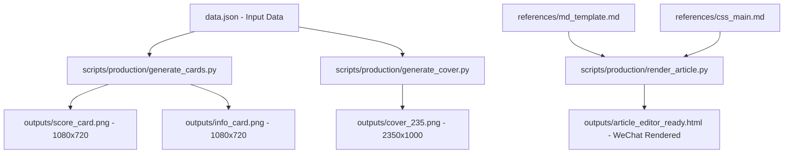

# Paper Notes - 论文速记生成器 / Paper Notes Generator

<div align="center">

**模板化生成论文速记全套物料**  
**Template-based generation for paper note cards & articles**

评分卡 · 信息卡 · 封面图 · 正文模板 · 公众号排版  
Score Cards · Info Cards · Cover Images · Article Templates · WeChat Formatting

[](https://opensource.org/licenses/MIT)
[](https://www.python.org/downloads/)

</div>

---

## 🚀 快速开始 / Quick Start

### 日常生产指南 / Daily Production Guide

如果目标是复现当前每日 `paper-notes` 生产流程（候选输入、选题、评分、PDF 核验、生成发布包、preflight、发布前编辑检查），请优先阅读：

[`docs/OPERATOR_GUIDE.md`](docs/OPERATOR_GUIDE.md)

### 安装依赖 / Install Dependencies

```bash
pip install -r requirements.txt
```

### 使用流程 / Workflow

```
准备数据 → 生成图片 → 编写正文 → 完成
Prepare Data → Generate Images → Write Article → Done
```

#### 1️⃣ 准备数据 / Prepare Data

复制 `references/data_template.json`，填入论文信息：  
Copy `references/data_template.json` and fill in paper information:

```json
{
  "paper_title": "论文标题 / Paper Title",
  "score": {
    "total": 8.5,
    "dimensions": [
      {"label": "重要性 Impact", "value": 1.8},
      {"label": "创新性 Novelty", "value": 1.7},
      {"label": "可验证性 Evidence", "value": 1.6},
      {"label": "产业可用性 Applicability", "value": 1.7},
      {"label": "可复用性 Reusability", "value": 1.6}
    ]
  },
  "info": {
    "title": "英文标题 / English Title",
    "title_cn": "中文标题 / Chinese Title",
    "link": "https://arxiv.org/abs/XXXX.XXXXX",
    "authors": ["作者 1 / Author 1", "作者 2 / Author 2"],
    "affiliations": ["机构 A / Institution A", "机构 B / Institution B"]
  }
}
```

#### 2️⃣ 生成图片 / Generate Images

```bash
# 评分卡 + 信息卡 / Score Card + Info Card
python3 scripts/production/generate_cards.py --data data.json --out outputs/my-paper

# 封面图（可选）/ Cover Image (optional)
python3 scripts/production/generate_cover.py --data data.json --out outputs/my-paper/cover_235.png
```

#### 3️⃣ 编写正文 / Write Article

参考 `references/md_template.md` 填写 A-F 六段式内容：  
Refer to `references/md_template.md` for the A-F article structure:

| 段落 / Section | 说明 / Description |
|------|------|
| A. 研究问题 / Research Question | 一句话说明问题 / One-sentence problem statement |
| B. 核心贡献 / Core Contributions | 列出 2-3 个贡献点 / List 2-3 contributions |
| C. 方法/框架 / Method/Framework | 描述技术方法 / Describe technical approach |
| D. 关键结果 / Key Results | 指标/对比/结论 / Metrics/comparison/conclusions |
| E. 产业启示 / Industry Implications | 对行业的启发 / Implications for industry |
| F. 一句话判断 / Final Verdict | 站队结论 / One-sentence verdict |

---

## 📦 输出样例 / Output Examples

| 文件 / File | 说明 / Description |
|------|------|
| `score_card.png` | 五维评分卡 / 5-Dimension Score Card |
| `info_card.png` | 论文信息卡 / Paper Info Card |
| `cover_235.png` | 2.35:1 封面图 / 2.35:1 Cover Image |
| `note.md` | 正文 Markdown / Article in Markdown |
| `article_editor_ready.html` | 公众号 HTML / WeChat Article HTML |

查看完整样例 / View full examples: [`examples/`](examples/)

---

## 📁 项目结构 / Project Structure

```
paper-notes/
├── references/          # 模板与说明 / Templates & Docs
├── scripts/production/  # 正式生产脚本 / Production Scripts
├── outputs/             # 最终产物 / Final Outputs
├── examples/            # 输出样例 / Output Examples
├── docs/                # 完整文档 / Full Documentation
└── assets/              # logo/字体 / Logo & Fonts
```

---

## 🎨 定制 / Customization

- **配色方案 / Color Scheme**：编辑 `references/css_main.md`
- **评分维度 / Score Dimensions**：修改 `data.json` 中的 `score.dimensions`
- **正文模板 / Article Template**：编辑 `references/md_template.md`

---

## 📄 许可证 / License

MIT License - 自由使用，欢迎贡献 / Free to use, contributions welcome

---

## 🔗 相关项目 / Related Projects

- 公众号 "AI 系统笔记" / WeChat Official Account "AI System Notes" - 每日论文速记解读 / Daily paper note interpretations

---

## 🤖 Code Wiki & AI Integration / Code Wiki 与 AI 集成

To ensure that Google's **Code Wiki** parser can accurately crawl, classify, and explain this repository, the following visual schema and data flows define the automation pipeline.

### 🗺️ AI Architecture Map / 架构地图



- **Input Validation Module**: Ingests JSON files mapping to [`references/data_template.json`](references/data_template.json).
- **Asset Generation Module**: Uses PIL/Pillow to generate pixel-precise images (`score_card.png`, `info_card.png`, and `cover_235.png`) utilizing the custom OTF fonts embedded in `assets/`.
- **Render Engine**: Transforms standard A-F markdown structures mapped in [`references/md_template.md`](references/md_template.md) along with custom CSS tokens in [`references/css_main.md`](references/css_main.md) to generate WeChat-formatted HTML articles.

---

### 🎨 Output & Visual Layout Showcase / 输出与视觉布局细节

This tool output is optimized for high-impact social sharing and WeChat official account integration:

#### 1. Image Specifications
*   **五维评分卡 / Score Card (`score_card.png`)**:
    *   **Resolution**: 1080x720px
    *   **Design**: Radar/Dimension representation of 5 indicators: Importance (Impact), Innovation (Novelty), Verifiability (Evidence), Industry Applicability (Applicability), and Reusability (Reusability).
*   **论文信息卡 / Info Card (`info_card.png`)**:
    *   **Resolution**: 1080x720px
    *   **Design**: Clean layout listing metadata (Title, Link, Authors, and Affiliations) in high-contrast styling.
*   **公众号封面 / Cover (`cover_235.png`)**:
    *   **Resolution**: 2350x1000px (Aspect Ratio: 2.35:1)
    *   **Design**: Minimalist post cover with title alignment.

#### 2. WeChat Official Account CSS Variables
Articles generated via `scripts/production/render_article.py` incorporate the following vanilla CSS framework elements:
```css
:root {
  --primary: #0052D9;   /* Tencent Blue */
  --secondary: #E34D59; /* Accent Red */
  --bg: #F7F9FC;        /* Light Grayish Blue Background */
  --text: #333333;      /* Standard Dark Text */
  --muted: #6B7280;     /* Muted Meta Info Text */
}
```

---

## ☕ 赞赏 / Sponsor

如果这个项目对你有帮助，欢迎请我喝杯咖啡：  
If this project helps you, consider buying me a coffee:

### 微信赞赏 / WeChat Reward（国内用户）

<div align="center">

<p><em>微信扫码赞赏 / Scan WeChat QR to Sponsor</em></p>
</div>

建议金额 / Suggested amounts: **¥9.9** / **¥49** / **¥199**

---

### PayPal（国际用户 / International Users）

如果你使用 PayPal，可以通过以下链接赞助：  
If you prefer PayPal, you can sponsor via:

**[https://paypal.me/aisystemnotes](https://paypal.me/aisystemnotes)**

建议金额 / Suggested amounts: **$1.99** / **$9.99** / **$49.99**
